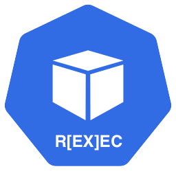

# kubectl-rexec

Kubectl exec does not provide any kind of audit what is actually done inside the container. Rexec plugin is here to help with that.

## Contributing
We strongly encourage you to contribute to our repository. Find out more in our [contribution guidelines](https://github.com/Adyen/.github/blob/master/CONTRIBUTING.md)

## Requirements
In kubernetes 1.30 `TranslateStreamCloseWebsocketRequests` featuregate is true by the default making protocol between kubectl and kube-apiserver is websocket while prior is SPDY, this solution handles only websockets so the k8s cluster either has to be 1.30 or 1.29 with `TranslateStreamCloseWebsocketRequests=true` feature flag. Version below 1.29 are not supported.

## Installation
See the [Getting started](https://github.com/Adyen/kubectl-rexec/blob/master/STARTED.md) guide.

## Usage
See the [Getting started](https://github.com/Adyen/kubectl-rexec/blob/master/STARTED.md) guide.

## Documentation
See the [Design](https://github.com/Adyen/kubectl-rexec/blob/master/DESIGN.md).

## Support
If you have a feature request, or spotted a bug or a technical problem, create a GitHub issue.

## License    
MIT license. For more information, see the LICENSE file.